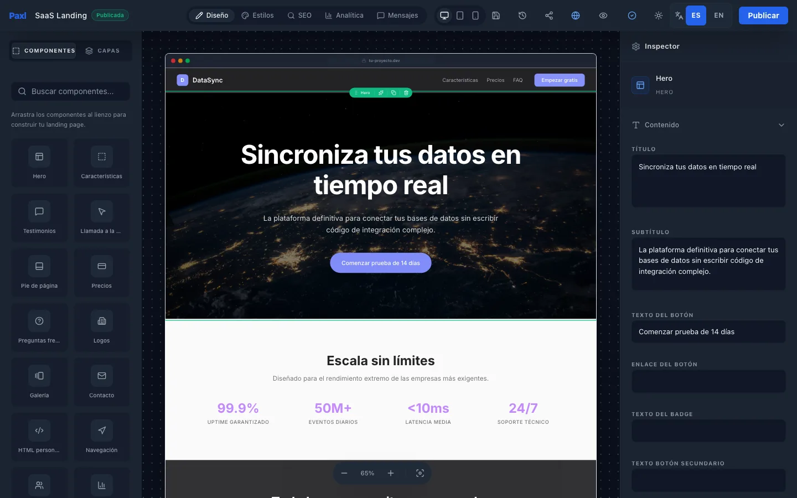
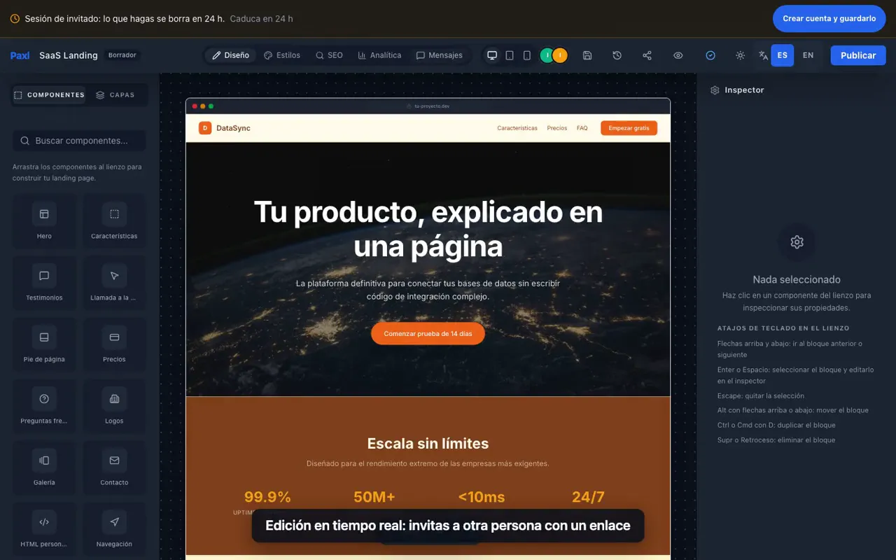
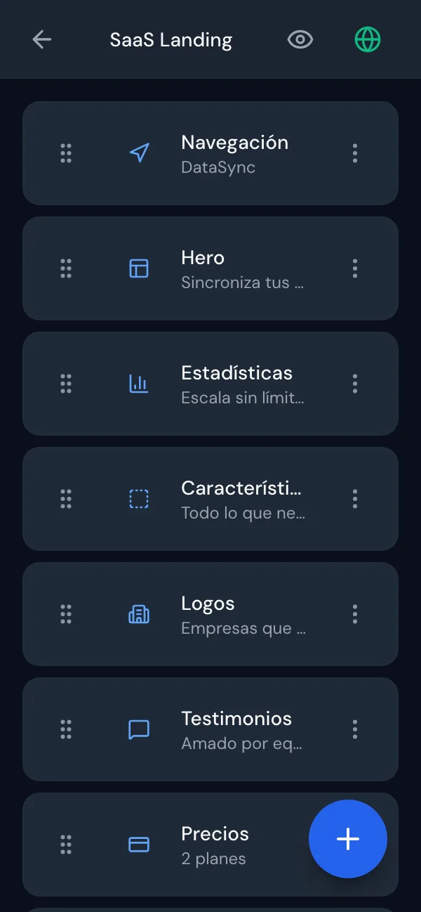
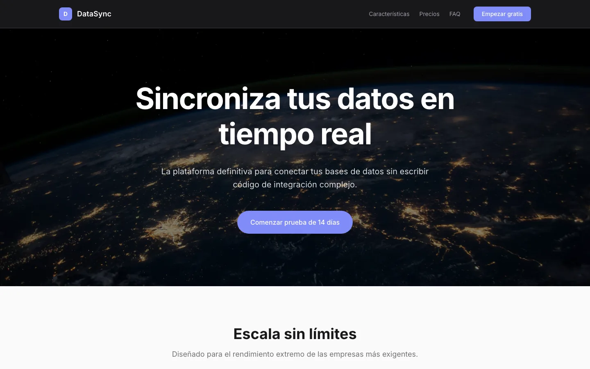
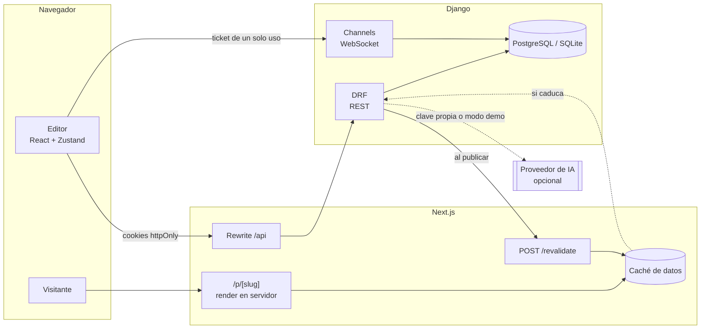

# Paxl

[](https://github.com/davidpalmerojara/landing-cms/actions/workflows/ci.yml)

Editor visual de landing pages: montas la página con bloques, la ves en escritorio, tablet y móvil, la editas con otras personas a la vez y la publicas con su propia dirección. Frontend en Next.js, React y TypeScript; backend propio en Django, Django REST Framework y Channels.

*A visual landing-page editor with typed blocks, design tokens, server-rendered published pages, real-time collaboration and structured AI generation. Next.js + TypeScript frontend, Django + DRF + Channels backend.*



**Vídeo de 65 segundos** grabado sobre la aplicación real: sesión de invitado, edición, diseño por dispositivo, tema, listas, otra persona editando a la vez y publicación.

[](docs/video/paxl-demo.mp4)

## Qué se puede hacer

- **Editar con bloques.** 15 tipos de bloque (hero, características, precios, FAQ, galería, equipo, formulario de contacto…) con contenido tipado. Las listas se añaden, quitan y reordenan, y deshacer revierte cada cambio como un paso.
- **Diseñar con un tema, no bloque a bloque.** Colores, tipografía, espaciado y bordes son *design tokens* de la página; hay paletas de partida y aviso de contraste WCAG.
- **Verla en cualquier pantalla.** Los bloques eligen su diseño con *container queries*, así que el mismo CSS sirve en la página real y en los marcos de móvil y tablet del editor.
- **Publicar sin miedo.** Publicar congela una copia: lo que editas no llega a los visitantes hasta que vuelves a publicar. La página pública se renderiza en el servidor y se cachea hasta la siguiente publicación.
- **Recibir contactos y medir visitas.** Formulario de contacto con los mensajes en el editor, y analítica sin cookies ni nada guardado en el dispositivo del visitante.
- **Editar a la vez con otras personas.** Presencia, bloqueo por bloque, cursores y una fusión en tres vías que no pierde los cambios de nadie. Un enlace de invitación permite probarlo con una segunda ventana.
- **Generar con IA.** La IA devuelve bloques que pasan por la misma validación que el editor. En la demo no gasta nada: sirve páginas guardadas y lo dice; con tu propia clave genera de verdad.
- **Probar sin registrarse.** Sesión de invitado de 24 horas, con límites contra abusos.
- **En español e inglés**, interfaz y contenido. Accesible con teclado (WCAG 2.2 AA como objetivo).

| Móvil | Página publicada |
|---|---|
|  |  |

## Arquitectura



- **Un solo origen para el navegador.** Next reenvía `/api` a Django, así que las cookies de sesión (httpOnly, sin tokens en JavaScript) son del mismo sitio aunque el backend esté en otro dominio. Las escrituras comprueban la cabecera `Origin`.
- **El servidor manda.** Cada página tiene una versión; un guardado basado en una versión vieja recibe 409 y el cliente fusiona. El WebSocket solo avisa de que algo cambió (y retransmite la escritura en vivo del bloque bloqueado).
- **Una sola puerta para el contenido.** Todo lo que entra en un bloque, venga del editor, del WebSocket, de la IA o de una versión restaurada, pasa por `clean_block_data`: lista blanca de campos, enlaces y URLs seguros, texto saneado una sola vez.

## Decisiones

Están en [`DECISIONS.md`](DECISIONS.md), con su contexto, alternativas y consecuencias. Las que más explican el proyecto:

| ADR | Decisión |
|---|---|
| [004](DECISIONS.md#adr-004-bloques-tipados-atómicos-sobre-editor-libre) / [021](DECISIONS.md#adr-021-las-listas-de-los-bloques-son-arrays-tipados) | Bloques tipados en lugar de un editor libre; listas como arrays con unión discriminada en TypeScript |
| [008](DECISIONS.md#adr-008-jwt-solo-en-cookies-httponly-con-comprobación-de-origin) / [010](DECISIONS.md#adr-010-autenticación-del-websocket-con-la-cookie-de-sesión) | Sesión solo en cookies httpOnly; WebSocket con ticket de un solo uso |
| [014](DECISIONS.md#adr-014-ids-de-bloque-generados-en-el-cliente) | IDs de bloque generados en el cliente: sin remapeo tras el autoguardado |
| [017](DECISIONS.md#adr-017-publicar-es-congelar-una-copia) / [019](DECISIONS.md#adr-019-la-página-publicada-se-renderiza-en-el-servidor) | Publicar congela una copia; la página pública se renderiza en el servidor y se revalida al publicar |
| [020](DECISIONS.md#adr-020-un-solo-sistema-de-tema-design-tokens) | Un solo sistema de tema (design tokens), con migración de los temas antiguos |
| [023](DECISIONS.md#adr-023-la-ia-de-la-demo-no-cuesta-nada-y-lo-dice) | IA en tres capas: clave propia, modo demo y clave del servidor con topes |
| [024](DECISIONS.md#adr-024-colaboración-segura-versión-de-página-fusión-y-presencia-por-conexión) | Colaboración: versión de página, 409 y fusión en tres vías |

[`docs/bugs-notables.md`](docs/bugs-notables.md) cuenta los fallos que se encontraron, cómo se detectaron y cómo se verificó cada arreglo.

## Calidad

- **Backend:** pytest, unos 1.500 tests, incluidos tests del WebSocket con `WebsocketCommunicator`, una carrera real entre dos guardados y los permisos cruzados entre usuarios.
- **Frontend:** Vitest y Testing Library, unos 640 tests, incluida la fusión de páginas con pruebas de propiedades sobre ediciones aleatorias.
- **De punta a punta:** Playwright contra el stack real (Daphne y `next start`): invitado, cuenta, publicación y colaboración entre dos navegadores.
- **CI** en cada push: tests, tipos (`tsc` estricto, sin `any`), lint, una comprobación de que cada clase de Tailwind genera CSS, build y la suite de punta a punta.

## Cómo ejecutarlo

Requisitos: Python 3.13, Node 20.19 o superior (`.nvmrc`) y `make`. No hace falta ningún servicio externo: en local se usa SQLite, la capa de canales en memoria y el email se imprime en la consola.

```bash
make install   # crea backend/venv, instala dependencias y copia los .env de ejemplo
make migrate   # crea la base de datos SQLite y los planes Free/Pro
make dev       # arranca backend y frontend; Ctrl+C para parar los dos
```

- Frontend: http://localhost:3000
- API: http://localhost:8001/api

`make install` no sobrescribe un `backend/.env` ni un `frontend/.env.local` que ya existan. Las variables están documentadas en `backend/.env.example` y `frontend/.env.example`.

| Comando | Qué hace |
|---|---|
| `make dev` | Backend (8001) y frontend (3000) a la vez |
| `make backend` / `make frontend` | Cada parte por separado |
| `make test` | Tests de backend (pytest) y frontend (Vitest) |
| `make e2e` | Suite de punta a punta con Playwright |
| `make typecheck` / `make lint` / `make build` | Comprobaciones del frontend |
| `make check` | Los mismos pasos que el CI |
| `make lock` | Regenera el lockfile de Python desde `backend/requirements.in` (requiere [uv](https://docs.astral.sh/uv/)) |

## Limitaciones conocidas

- **Tiempo real en un solo proceso.** Sin Redis, la presencia, los bloqueos y la capa de canales viven en la memoria de un único proceso del servidor (ADR-015). Con `REDIS_URL` se comparten los bloqueos, pero la lista de presencia sigue siendo por proceso.
- **La IA de la demo no genera en vivo.** Sirve diez páginas de ejemplo escritas a mano y lo dice en pantalla; con tu propia clave de Gemini o Anthropic genera de verdad.
- **El email se imprime en la consola** salvo que se configure un servidor SMTP, así que el acceso por enlace mágico no llega a ningún buzón en la demo.
- **Dominios propios desactivados** (`CUSTOM_DOMAINS_ENABLED`): necesitan DNS y certificados que el hosting gratuito no ofrece.
- **Accesibilidad pendiente:** los bordes de campos y tarjetas no llegan a 3:1 de contraste, la página publicada no tiene enlace para saltar al contenido y la edición de texto directamente en el lienzo solo se abre con doble clic (con teclado se edita desde el inspector).

## Estructura

```
frontend/   Next.js (App Router): app/, components/, hooks/, lib/, store/, types/
backend/    Django: accounts, pages, submissions, analytics, ai_generation, billing, collaboration
docs/       Fallos notables y su verificación
DECISIONS.md   Decisiones de arquitectura (ADR)
AGENTS.md      Guía del código: convenciones, modelo de datos y endpoints
```
